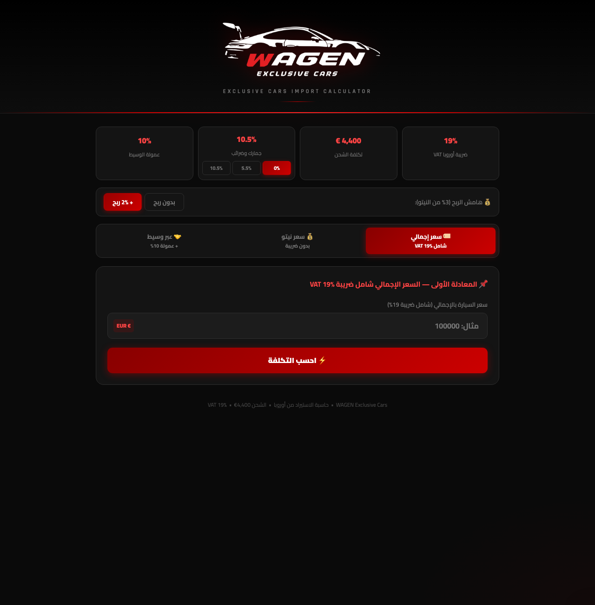

# 🚗 Car Import Cost Calculator — Europe → Oman (WAGEN Exclusive Cars)

**Live:** https://saif7xx.github.io/car-calculator/

Calculates the **full landed cost and selling price** of a car bought in Germany/Europe and imported to Oman — the pricing tool behind every WAGEN deal.

## What it calculates
| Path | Input | Logic |
|---|---|---|
| Gross price | Price incl. EU VAT 19% | Removes VAT, adds shipping and Omani customs |
| Net export price | Price without VAT | Direct export price |
| Via broker | Gross price | Adds 10% broker commission on the VAT value |

- Shipping (default €4,400), customs & taxes (0% / 5.5% / 10.5% / 10%), profit-margin options.
- Step-by-step breakdown of every cost line, then **EUR → OMR** and other currency conversion.
- Arabic RTL, one self-contained HTML file.

## Tech
HTML · CSS · JavaScript.

## Context
Built May–July 2026 (≈16 versions) for **WAGEN Exclusive Cars** (luxury car import, Muscat). Also exists as an Excel version. Built with an AI-assisted workflow (Claude Code): Saif wrote the requirements and specifications, made the architecture and business-rule decisions, and reviewed and tested the result.
